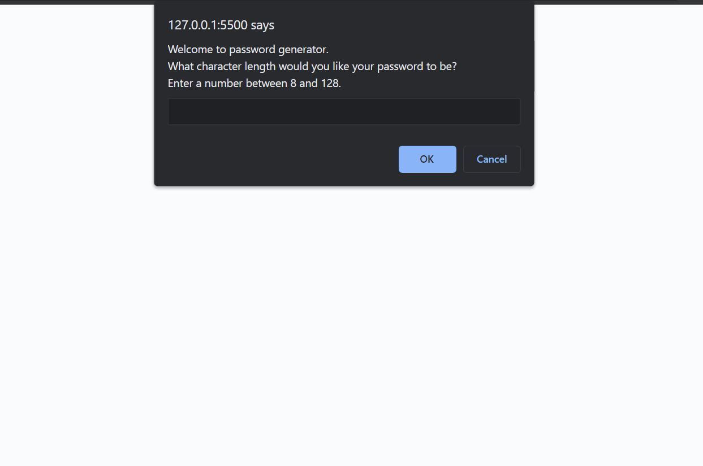

# UCI Coding Bootcamp
## Javascript Password Generator

### Decription
A password generator in pure javascript that prompts user for password parameters.

### Installation
Link to the deployed application can be found [here](https://google.com "JavaScript Password Generator").

### Usage
Navigte to the deployed project. Enter the length of your password in the prompt. Select OK to include a type of character in your password. Cancel to not include. You can run it multiple times. Refresh the page to enter different password parameters.  Here is a recording of an example interaction: 

### Features
* Entering length of password
* Include or exclude certain types of characters from the generated password
* Password requirements and a min/max length enforced
* If any of the requirements are not met, the user will be re-prompted